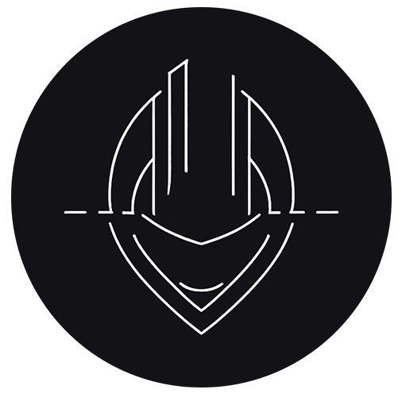

<p align="center">
  
</p>

# 🛠️ Bitoreum Builder

A fully automated build script for compiling [Crystal Bitoreum](https://github.com/Nikovash/bitoreum) or other forks.  
Supports multiple target architectures and generates stripped, not-stripped, and debug builds, each with full checksums and compressed archives.

**Version:** 1.8

---

## 🚀 Features

- ✅ System `update` & `upgrade`
- ✅ Dependency check & `install`
- ✅ Python 3.10.17 setup (if missing)
- ✅ Clone from `main` or custom branch
- ✅ Platform selection:
  - Linux x86_64-bit
  - Linux x86_32-bit
  - Linux ARM_32-bit
  - Linux ARM_64-bit
  - Raspberry Pi 4+
  - Ampere
  - Windows x86-64 Cross Compile
  - ❌ Cancel and exit
- ✅ Fully separate debug build
- ✅ Stripped and unstripped binaries
- ✅ Per-build and archive-level SHA + OpenSSL-style checksums
- ✅ `*.tar.gz` compression For Linux (max level)
- ✅ `*.zip` compression For Windows (max level)

---

## 📦 Requirements

- Linux (Ubuntu 18.04+ recommended)
- `sudo` privileges
- Internet connection
- Optional: `screen` (for remote session safety)

---

## 📥 Usage

### 🔹 1. install git
Some distros do not install this by default
```bash
sudo apt update
sudo apt install git -y
```

### 🔹 2. Clone and prepare
```bash
git clone https://github.com/Nikovash/bitoreum-builder.git
cd bitoreum-builder
(chmod +x bake.sh) // Optional now is shipped with executable enabled by default
```
Launch a screen (Optional but recommended):
```bash
screen -S build
```
Once insides the screen we can now run the app:
```bash
./bake.sh
```
On first run the app will update your system and install the bare minimum system packages for use. Optioanl packages for cross compiling are beyond the scope of this document. Come find me I can probably help you!

Once the system is updated python 3.10.17 will be made an `altinstall`, this is sometimes a requirement of two of the dependancies used. this installes it along side your systems python not as a replacement for it so nothing breaks!

Once this is done, you be asked for a branch to `bake` from the default is `main`, though that is not the current release. You can pick from any branch releases will have a `v` in front of them. As an example, at the time of this writing, the current release would be branch `v4.1.0.0`.

One a valid brance is selected you will be asked if you want to include QT, which is the GUI wallet, not everyone needs or wants it, and it is increadably resource heavy. So now if you now need it you can shave a lot of time off your build by not building for it!

That is it, unless there is an error, which normally only happens when cross compiling, the script will run and at the end you will have three version in two formats:
- Build (release)
- Not-Stripe
- Debug

All of which will be uncompressed in their respective folder found at `~/bitoreum-build` and the compressed version found in `~/bitoreum-build/compressed` all with checksums.

You can tail the less critical and noisy logging of this script by tailing the file created called `bake_bread.log`
```bash
tail -f bake_bread.log
```
You can disconnect the screen at any time by pressing:
```bash
CNTL+A then D
```
And recooenct at any time with:
```bash
screen -r
```
If this is a remote session and the screen is still attached to a screen that was from a dropped connection you can force detact and reattach it to your current session with:
```bash
screen -D -r
```

<p align="center">* Screen changed from automatic to manual usage, due to weird behavior on older Distros</p>
